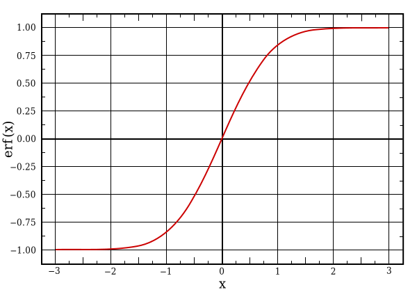

# Video Analysis

## How it works now

At the moment, we use a very simple and easy model;
We calculate the first two "central sample moments" of the video data.
In plain language, this is the *mean* and the *covariance*.
Since all the statistics are normalized, this ends up being the same thing as the sample *correlation*, which might be more familiar.

Approximately 25 times per second we receive 3 matrixes full of pixel information from the video camera. Depending on the camera, this could be 1 megapixel or approximately 3 megabytes of data per frame

This is too much data, however, for such simple statistics, so we preprocess it in the following ways.

First, we *downsample* the video and chop it into a 64x64 pixel square.

Second, we convert the colorspace from Red/Green/Blue to [Y/Cb/Cr](https://en.wikipedia.org/wiki/YCbCr)
because otherwise blue and green are too similar to each other,
and *everything* is too similar to brightness).
Approximately speaking, "Y" is "brightness", "Cb" is "blueness"
and "Cr" is "Redness".

At this stage we have 3 64x64 matrixes: $$ Y,C^b,C^r. $$
You can imagine them like this:

For each of these we calculate the mean, a Y-mean, $$ \bar{Y}, $$ a Cb-mean $$ \bar{C}^b $$ etc

$$ \bar{Y} = \frac{1}{64}\sum_{i=1}^{64}\frac{1}{64}\sum_{j=1}^{64} Y_{ij} $$

These are the *first moments*.

Now for the *second moments*....

We add spatial coordinates to the pixels - a pixel on the left side of the screen has a $$ V $$ coordinate of 0. On the right side it has a coordinate of 64. On the bottom of the screen it would have a $$ U $$ coordinate of 0 and on the top, 64. Now we "unpack" these index matrices into a 5x4096 sample matrix (We call the first column $$U$$ and the second column $$V$$

$$ \begin{align*}
X &:= \begin{pmatrix}
1 & 1 & Y_{1,1} & C^b_{1,1} & C^r_{1,1}\\
1 & 2 & Y_{1,2} & C^b_{1,2} & C^r_{1,2}\\
\vdots &\vdots& \vdots &\vdots &\vdots\\
1 & 64 & Y_{1,64} & C^b_{1,64} & C^r_{1,64}\\
2 & 1 & Y_{2,1} & C^b_{2,1} & C^r_{2,1}\\
\vdots &\vdots& \vdots &\vdots &\vdots\\
64 & 64 & Y_{64,64} & C^b_{64,64} & C^r_{64,64}\\
\end{pmatrix}\\
&= \begin{pmatrix}\mathbf{u}&\mathbf{v}&\mathbf{y}&\mathbf{c}^b&\mathbf{c}^r\end{pmatrix}
\end{align*}$$

The second moments are the sample covariance /correlation of this unpacked matrix $$ X. $$ But for these remaining values we can calculate covariances, e.g.

$$
\begin{align*}
\operatorname{Cov}(\mathbf{u},\mathbf{y}) &= \frac{1}{4096} \sum_{i=1}^{4096} (\mathbf{u}_i-\bar{\mathbf{u}})(\mathbf{y}_i-\bar{\mathbf{y}})
\end{align*}
$$
We can also calcualte self-variance, e.g. $$ \operatorname{Cov}(\mathbf{y},\mathbf{y}) $$ which is just the usual variance.
The **u,v** columns aren't interesting, because we just made them up, so we do *not* calculate $$ \operatorname{Cov}(\mathbf{u},\mathbf{u}),  \operatorname{Cov}(\mathbf{u},\mathbf{v}),  \operatorname{Cov}(\mathbf{v},\mathbf{v})  $$, but all the rest are useful. So, for example $$ \operatorname{Cov}(\mathbf{u},\mathbf{c}^b) $$ tells you how much the red *increases* as you go *up* the page.

**NB** this part is constantly changing.
If you notice that I've flipped green and red, or up and down, then feel free to update the documentation ;-)

## Mapping the statistics

The problem now is that these value are *arbitrary*. Who cares if $$\bar{\mathbf{C}^b}=0.78$$? What does that number mean?
What MIDI note is $$0.78$$? What MIDI CC value?
What tempo? How can we relate *statistics* to *parameters*?

The answer is that we choose a common language.

In Synestizer/LTC, *all* the numbers are transformed so that they range between -1 and +1. And all musical parameters expect a number from -1 to +1... Then we map -1 to, say, a low note like C2 and +1 to a high note like C4, and everything else in between goes to notes in between, e.g. 0 goes to C3 and 0.5 to G3 and so on.

We can also make combination parameters from the existing parameters. When you use the `Patching` interface to create a MIDI CC output, or a combination signal... this is how it works.

Let's say you have a combination signal $$ \alpha $$.
Then you can choose some scale parameter and some other inputs, $$s_1, s_2,\dots,$$ and we create a combination output that still fits in the $$(-1,1)$$ range like this.

$$
\alpha = \phi\left(s_1\phi^{-1}(\operatorname{Cov}(\mathbf{u},\mathbf{y})) + s_2\phi^{-1}(\bar{\mathbf{x}}) + \dots\right) 
$$

Here $$\phi$$ is any 'sigmoid' function and $$\phi^{-1}$$ is the inverse function. 

Sigmoid functions 'squash' a possibly-infinite number range into the $$(-1,1)$$ range.

## Ideas for the future

* nearest-neighbours in color space
* image descriptors
* PCA
* Haar cascade.
* random IIR filters
* cascaded IIR lowpass filters at successively lower resolution
* peaks, troughs
* max pooling, min pooling
* Relu
* autocorrelation
* FFT features (or something else translation/phase-invariant?)
* inner-product with desired eigen-features
* user interaction: They choose a few key scenes, and we try to measure distance from those scenes.
* other clustering, say, spectral?
* [motion detection](http://www.adobe.com/devnet/html5/articles/javascript-motion-detection.html)
* [various sweet segmenations hacks](https://stackoverflow.com/questions/31071781/html5-canvas-image-segmentation)
* neural networks?

    * We can [train them online](https://cs.stanford.edu/people/karpathy/convnetjs/)
    * https://github.com/karpathy/recurrentjs
    * or use a high-performance pre-trained JS prediction models via [neocortex.js](https://github.com/scienceai/neocortex)?
    Note this would also get us features for free even if we ignore the model.
    * can we do *recursive* NN for realtime stuff this way?
    * Examples from keras https://github.com/fchollet/keras/tree/master/examples
    * torch examples http://www.di.ens.fr/willow/research/weakcnn/ https://hal.inria.fr/hal-01015140

* random forests

    * https://github.com/karpathy/forestjs
    * http://techtalks.tv/talks/randomized-decision-forests-and-their-applications-in-computer-vision-jamie/59432/

## Colour handling

* [colorspaces](https://vis4.net/blog/posts/avoid-equidistant-hsv-colors/)
* [colormaps](http://www.sandia.gov/~kmorel/documents/ColorMaps/ColorMapsExpanded.pdf)
* [excellent series on color](http://earthobservatory.nasa.gov/blogs/elegantfigures/2013/08/05/subtleties-of-color-part-1-of-6/)
